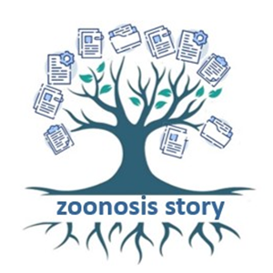

# Storie di Zoonosi
<p align="center">
  <a href="#"></a>
  <a href="#"></a>
  <a href="https://github.com/SP-Vet/storiedizoonosi/blob/main/LICENSE"></a>
  <a href="https://storiedizoonosi.spvet.it"></a>
  <a href="mailto:redazione-spvet@izsum.it"></a>
</p>
<hr>
The Micro Epidemic One Health Project (Italian Ministry of Health Research Project: MEOH/2021-2022 - IZS UM 04/20 RC)

<div align="center">
    <a href="https://storiedizoonosi.spvet.it/">
      <br>
      <b>https://storiedizoonosi.spvet.it</b>
    </a><br><br><br>
    <a href="https://izsum.it/">
        <br>
        <b>https://izsum.it</b>
    </a><br><br><br>
    <a href="https://spvet.it/">
        <br>
        <b>https://spvet.it</b>
    </a>
</div>

<details>
  <summary>Table of Contents</summary>
  <ol>
    <li><a href="#about-the-project">About The Project</a></li>
    <li><a href="#built-with">Built With</a></li>
    <li><a href="#screenshots">Screenshots</a>
    <ol>
      <li><a href="#screen-front-end">Front-End</li>
      <li><a href="#screen-back-end">Back-End</li>
    </ol>
    </li>
    <li><a href="#before-installation">Before Installation</a></li>
    <li><a href="#installation">Installation</a></li>
    <li><a href="#configuration">Configuration</a></li>
    <li><a href="#import-database">Import Database</a></li>
    <li><a href="#license">License</a></li>
    <li><a href="#contacts">Contacts</a></li>
  </ol>
</details>

## About The Project
The Micro Epidemic One Health Project, aims to create an open repository of narratives concerning zoonoses; diseases transmitted from animals to humans and vice versa. These zoonoses tales, derive from the recording of interviews or free narrations of privileged witnesses (Veterinarians, Healthcare Professionals, Researchers) who really faced and experienced them in their professional activity. The narratives - case studies, are made freely available to readers through a Web hypertext accessible from the Internet and a Smartphone App. Texts, annotated through crowdsourcing, are linked to peer reviewed scientific literature by experts and documentalists. They represent valid teaching material for young doctors and veterinarians, as well as an informational instrument for the civilian population. So that way, the Micro Epidemic One Health Project will contribute to promote a greater sharing of scientific knowledge on zoonoses making it easier to detect them early and contrast them in the appropriate ways.

## Built With
* [![Laravel][Laravel.com]][Laravel-url]
* [![Bootstrap][Bootstrap.com]][Bootstrap-url]
* [![JQuery][JQuery.com]][JQuery-url]
* [![PostgreSQL][PostgreSQL.org]][PostgreSQL-url]

## Screenshots

### Front-end


### Back-end


## Before installation
Register a new free account on https://www.mtcaptcha.com/ 

## Installation
First clone this repository

```
git clone git@github.com:SP-Vet/storiedizoonosi.git stories
```

Install the dependencies

```
composer install
```

Setup your .env file

```
cp .env.example .env
```

Generate a new app encryption key

```
php artisan key:generate
```

Create the symbolic link

```
php artisan storage:link
```


Install the DBMS PostgreSQL on your machine [https://www.postgresql.org/download/]
and create a new database

## Configuration
**In your copy of the new .env files add:**<br>
PUBLIC_KEY_STRING = [string of sixteen characters with uppercase, lowercase and numbers]<br>
PRIVATE_KEY_STRING = [string of sixteen characters with uppercase, lowercase and numbers]<br>
NOME_SITO = [name of the project without empty spaces]<br>
MTCAPTCHA_PRIVATE = [private key released after the registration on mtcaptcha.com]<br>
MTCAPTCHA_PUBLIC = [public key released after the registration on mtcaptcha.com]<br>

**In your copy of the new .env files modify:**<br>
DB_HOST, DB_PORT, DB_DATABASE, DB_USERNAME, and DB_PASSWORD with the parameters of the PostgreSQL database<br><br>
MAIL_MAILER, MAIL_HOST,MAIL_PORT, MAIL_USERNAME, MAIL_PASSWORD, MAIL_ENCRYPTION, MAIL_FROM_ADDRESS with your email parameters

## Import Database
After agreeing with the organization (**redazione-spvet@izsum.it**) install the database dump that will be provided

## License
Distributed under the Apache 2.0 License. See `LICENSE.txt` for more information.

## Contacts
Redazione SPVET - redazione-spvet@izsum.it<br>
Raoul Ciappelloni - r.ciappelloni@izsum.it<br>
Eros Rivosecchi - e.rivosecchi@izsum.it


<!-- MARKDOWN LINKS & IMAGES -->
<!-- https://www.markdownguide.org/basic-syntax/#reference-style-links -->
[contributors-shield]: https://img.shields.io/github/contributors/othneildrew/Best-README-Template.svg?style=for-the-badge
[contributors-url]: https://github.com/othneildrew/Best-README-Template/graphs/contributors
[forks-shield]: https://img.shields.io/github/forks/othneildrew/Best-README-Template.svg?style=for-the-badge
[forks-url]: https://github.com/othneildrew/Best-README-Template/network/members
[stars-shield]: https://img.shields.io/github/stars/othneildrew/Best-README-Template.svg?style=for-the-badge
[stars-url]: https://github.com/othneildrew/Best-README-Template/stargazers
[issues-shield]: https://img.shields.io/github/issues/othneildrew/Best-README-Template.svg?style=for-the-badge
[issues-url]: https://github.com/othneildrew/Best-README-Template/issues
[license-shield]: https://img.shields.io/github/license/othneildrew/Best-README-Template.svg?style=for-the-badge
[license-url]: https://github.com/othneildrew/Best-README-Template/blob/master/LICENSE.txt
[linkedin-shield]: https://img.shields.io/badge/-LinkedIn-black.svg?style=for-the-badge&logo=linkedin&colorB=555
[linkedin-url]: https://linkedin.com/in/othneildrew
[product-screenshot]: images/screenshot.png
[Next.js]: https://img.shields.io/badge/next.js-000000?style=for-the-badge&logo=nextdotjs&logoColor=white
[Next-url]: https://nextjs.org/
[React.js]: https://img.shields.io/badge/React-20232A?style=for-the-badge&logo=react&logoColor=61DAFB
[React-url]: https://reactjs.org/
[Vue.js]: https://img.shields.io/badge/Vue.js-35495E?style=for-the-badge&logo=vuedotjs&logoColor=4FC08D
[Vue-url]: https://vuejs.org/
[Angular.io]: https://img.shields.io/badge/Angular-DD0031?style=for-the-badge&logo=angular&logoColor=white
[Angular-url]: https://angular.io/
[Svelte.dev]: https://img.shields.io/badge/Svelte-4A4A55?style=for-the-badge&logo=svelte&logoColor=FF3E00
[Svelte-url]: https://svelte.dev/
[Laravel.com]: https://img.shields.io/badge/Laravel-FF2D20?style=for-the-badge&logo=laravel&logoColor=white
[Laravel-url]: https://laravel.com
[Bootstrap.com]: https://img.shields.io/badge/Bootstrap-563D7C?style=for-the-badge&logo=bootstrap&logoColor=white
[Bootstrap-url]: https://getbootstrap.com
[JQuery.com]: https://img.shields.io/badge/jQuery-0769AD?style=for-the-badge&logo=jquery&logoColor=white
[JQuery-url]: https://jquery.com 
[PostgreSQL.org]: https://img.shields.io/badge/PostgreSQL-336791?style=for-the-badge&logo=PostgreSQL&logoColor=white
[PostgreSQL-url]: https://www.postgresql.org/